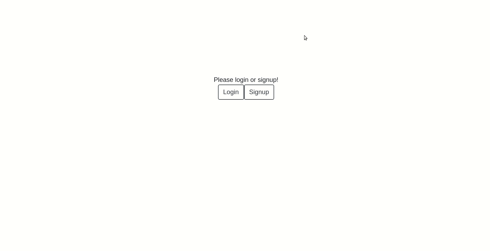

#Notes
## About 
Notes application made using React frontend and Django/Python backend

## Install Guide
1. cd into backend folder
2. `python3 manage.py migrate`
3. `python3 manage.py runserver`
4. cd into frontend folder
5. `npm i`
6. `npm start`
7. Hopefully it is straightforward from there!

## Tests
### Frontend
1. cd into frontend folder
2. run npm test

## Demo Gif

